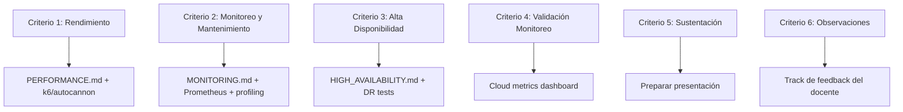

# Rúbrica de Evaluación — Proyecto Final

Transcripción y checklist técnico de la rúbrica del documento "PROY_INDICACIONES Y RÚBRICA_S12F".

> **Escala:** 4 (Estándar esperado) · 3 (En proceso 2) · 2 (En proceso 1) · 1 (Inicial)

---

## Criterio 1: Evaluación de Rendimiento

**Definición:** El estudiante evalúa el rendimiento del sistema mediante el análisis crítico de métricas clave, interpretando resultados en escenarios de carga para determinar el nivel de cumplimiento esperado.

### Checklist (8 elementos)

| # | Elemento | Peso | Estado actual |
|---|----------|------|---------------|
| 1 | Descripción del entorno de pruebas | 1/8 | ❌ Pendiente |
| 2 | Métricas evaluadas (tiempo respuesta, CPU, RAM, disco, red) | 1/8 | ❌ Pendiente |
| 3 | Herramientas utilizadas (k6, autocannon, etc.) | 1/8 | ❌ Pendiente |
| 4 | Resultados y comparación con umbrales/SLA | 1/8 | ❌ Pendiente |
| 5 | Gráficos y reportes de monitoreo | 1/8 | ❌ Pendiente |
| 6 | Pruebas de carga y estrés | 1/8 | ❌ Pendiente |
| 7 | Identificación de cuellos de botella | 1/8 | ❌ Pendiente |
| 8 | Conclusiones y acciones de mejora | 1/8 | ❌ Pendiente |

### Niveles
| Puntaje | Condición | Nota |
|---------|-----------|------|
| **4** | 8/8 elementos | Estándar esperado |
| **3** | 7/8 elementos | En proceso 2 |
| **2** | 5-6/8 elementos | En proceso 1 |
| **1** | ≤4/8 elementos | Inicial |

---

## Criterio 2: Evaluación del Monitoreo y Mantenimiento del Sistema

**Definición:** El estudiante evalúa la capacidad de mantenimiento del sistema mediante un monitoreo continuo según la ISO 25010.

### Checklist (8 elementos)

| # | Elemento | Estado actual |
|---|----------|---------------|
| 1 | Monitoreo de recursos (CPU, RAM, disco, red) | ❌ Pendiente |
| 2 | Reportes y capturas de monitoreo | ❌ Pendiente |
| 3 | Perfilamiento de código (Code Profiling) | ❌ Pendiente |
| 4 | Observaciones y conclusiones de monitoreo | ❌ Pendiente |
| 5 | Escenario del cambio realizado | ❌ Pendiente |
| 6 | Casos de prueba ejecutados (antes y después) | 🟡 Tests existen pero sin before/after |
| 7 | Impacto del cambio en el sistema | ❌ Pendiente |
| 8 | Estado final y conclusiones | ❌ Pendiente |

### Niveles
| Puntaje | Condición |
|---------|-----------|
| **4** | 8/8 elementos |
| **3** | 7/8 elementos |
| **2** | 5-6/8 elementos |
| **1** | ≤4/8 elementos |

---

## Criterio 3: Evaluación de Alta Disponibilidad y Recuperación de Desastres

**Definición:** El estudiante evalúa la capacidad del sistema para mantener disponibilidad y tolerancia a fallos mediante la ejecución de escenarios de alta disponibilidad y recuperación de desastres.

### Checklist (7 elementos)

| # | Elemento | Estado actual |
|---|----------|---------------|
| 1 | Escenarios de prueba simulados (caída servidor, pérdida datos, corte red) | ❌ Pendiente |
| 2 | Métricas de recuperación (RTO, RPO) | ❌ Pendiente |
| 3 | Descripción del entorno de pruebas (Alma Linux VMs) | ❌ Pendiente |
| 4 | Herramientas y configuraciones utilizadas | ❌ Pendiente |
| 5 | Evidencias de ejecución de pruebas de Alta Disponibilidad | ❌ Pendiente |
| 6 | Evidencias de ejecución de pruebas de Recuperación | ❌ Pendiente |
| 7 | Estado final y conclusiones | ❌ Pendiente |

### Niveles
| Puntaje | Condición |
|---------|-----------|
| **4** | 7/7 elementos |
| **3** | 6/7 elementos |
| **2** | 4-5/7 elementos |
| **1** | ≤3/7 elementos |

---

## Criterio 4: Validación del Monitoreo

**Definición:** El estudiante valida el monitoreo del sistema teniendo en cuenta recursos de hardware (memoria, CPU, disco) y evidencias de registro de eventos en la plataforma Cloud.

| Puntaje | Condición | Nota |
|---------|-----------|------|
| **2.0** | Valida monitoreo automático con memoria + CPU + disco + red + registro eventos en Cloud | Estándar esperado |
| **1.5** | Valida monitoreo con memoria + CPU + disco + registro eventos en Cloud | Adecuado |
| **1.0** | Valida monitoreo con memoria o CPU o disco + registro eventos en Cloud | Mínimo |
| **0.5** | Valida monitoreo con solo memoria o CPU o disco + registro eventos (sin Cloud) | Inicial |

---

## Criterio 5: Sustentación

**Definición:** El estudiante argumenta el proyecto con claridad, coherencia técnica y dominio conceptual.

### Checklist (4 puntos)

| # | Punto | Nota |
|---|-------|------|
| 1 | Expone los principales aportes al proyecto | |
| 2 | Sigue un orden lógico, coherente y con capacidad de síntesis | |
| 3 | Demuestra dominio del tema, argumentando y sustentando los artefactos elaborados | |
| 4 | Muestra el funcionamiento del sistema con alta disponibilidad | |

### Niveles
| Puntaje | Condición |
|---------|-----------|
| **2.0** | 4/4 puntos |
| **1.5** | 3/4 puntos |
| **1.0** | 2/4 puntos |
| **0.5** | 1/4 puntos |

---

## Criterio 6: Levantamiento de Observaciones

**Definición:** El estudiante realiza el levantamiento de todas las observaciones realizadas en el Avance de Proyecto Final 3.

| Puntaje | Condición |
|---------|-----------|
| **4** | 100% de observaciones levantadas |
| **3** | 80% de observaciones levantadas |
| **2** | 50% de observaciones levantadas |
| **1** | 30% de observaciones levantadas |

---

## Mapa de Implementación

> **Objetivo:** Alcanzar puntaje 4 en todos los criterios técnicos (C1-C4) antes de la sustentación.
